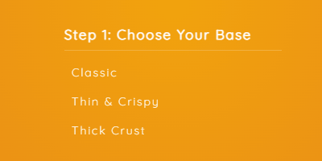
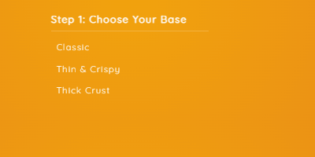
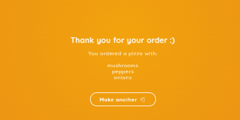
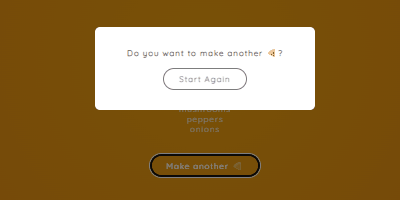

<!--
*** Thanks for checking out the react-framer-demo. If you have a suggestion
*** that would make this better, please fork the repo and create a pull request
*** or simply open an issue with the tag "enhancement".
*** Thanks again! Now go create something AMAZING! :D
***
*** To avoid retyping too much info. Do a search and replace for the following:
*** github_username (that is "windsuzu"), repo_name (that is "react-framer-demo"), project_title, project_description
-->

<!-- [![Issues][issues-shield]][issues-url] -->
<!-- [![PR Welcome][pr-welcome-shield]](#contributing) -->
[![Contributors][contributors-shield]][contributors-url]
[![MIT License][license-shield]][license-url]
[![Author][author-shield]][author-url]
[![LinkedIn][linkedin-shield]][linkedin-url]

<!-- PROJECT LOGO -->
<br />
<p align="center">
  <a href="https://windsuzu.github.io/react-framer-demo">
    
  </a>
  <h3 align="center">React Framer Demo</h3>
  <p align="center">
    A simple demo PIZZA app showing the use of Framer Motion library.
    <br />
    <a href="https://windsuzu.github.io/react-framer-demo">View Demo</a>
    ·
    <a href="https://github.com/windsuzu/react-framer-demo/issues">Report Bug</a>
    ·
    <a href="https://github.com/windsuzu/react-framer-demo/issues">Request Feature</a>
  </p>
</p>

<details>
<summary>Table of Contents</summary>

* [About](#about)
* [Tutorial](#tutorial)
  * [1. Basic Animation](#1-basic-animation)
  * [2. Variants](#2-variants)
  * [3. Hover Animation](#3-hover-animation)
  * [4. KeyFrames](#4-keyframes)
  * [5. Repeating Animation](#5-repeating-animation)
  * [6. Exit with AnimatePresence](#6-exit-with-animatepresence)
  * [7. React-Router-Dom v6 + AnimatePresence](#7-react-router-dom-v6--animatepresence)
  * [8. useCycle](#8-usecycle)
  * [9. drag](#9-drag)
* [Examples](#examples)
* [License](#license)
* [Contact](#contact)
* [Acknowledgements](#acknowledgements)

</details>

---

<!-- ABOUT THE PROJECT -->
## About

這裡展示如何使用 framer-motion 讓網頁元件動起來。

在 [Tutorial](#tutorial) 你可以看到所有 framer-motion 的用法講解；在 [Examples](#examples) 你可以點擊 gif 動畫觀看對應的原始碼。

<table>
<tr>
<td>

**Built With**

* HTML5, CSS3, Javascript ES6
* React.js
* framer-motion
* react-router-dom@v6

**[DEMO]** : https://windsuzu.github.io/react-framer-demo

</td>
</tr>
</table>

---

## Tutorial

### 1. Basic Animation

1. 導入 `motion` 並將他插入想要動畫的元件名稱 (e.g. `div` => `motion.div`)
2. `initial` 設定動畫開始前的位置、屬性
3. `animate` 設定動畫開始後的位置、屬性
4. `transition` 設定延遲 (`delay`)、動畫類型 (`type`, 有 `tween`, `spring`, etc) 和其他動畫設定
   * `duration`, `stiffness`, `mass`, `damping`,`repeat`, `repeatType`, `when`, `ease`, ...

``` js
import { motion } from "framer-motion";

<motion.div
    initial={{ y: -250 }}
    animate={{ y: -10 }}
    transition={{ delay: 0.3, type: "spring", stiffness: 120 }}>
    <h1>Pizza Joint</h1>
</motion.div>
```
---

### 2. Variants

使用 `variants` 包裝動畫可以讓 JSX 更乾淨。你可以在 `variants` 物件定義任何動畫，並且在 JSX component 上使用字串的方式呼叫動畫。

若是使用子元件 (child component) 使用的動畫 `variants` 的動畫命名一樣，可以省略不打。

``` js
const opacityVariants = {
    hidden: {
        opacity: 0,
    },
    visible: {
        opacity: 1,
        transition: { delay: 0.5, duration: 1 }
    },
};

<motion.div
    variants={opacityVariants}
    initial="hidden"
    animate="visible"
>
    // otherVariants also uses initial="hidden" and animate="visible"
    <motion.h1 variants={otherVariants}>Hello World</motion.h1>
</motion.div>
```
---

### 3. Hover Animation

我們可以用 `whileHover` 來觸發在 `variants` 定義好的動畫。

``` js
const btnHoverVariants = {
    hover: {
        scale: 1.1,
        ...
    },
};

<motion.button variants={btnHoverVariants} whileHover="hover">
    Create Your Pizza
</motion.button>
```
---

### 4. KeyFrames

只需要用陣列 (array) 設定屬性就可以讓動畫照順序執行。

``` js
const btnHoverVariants = {
    hover: {
        x: [0, 10, 0, 10, 0]
        scale: [1.5, 1, 1.5, 1, 1.5]
        ...
    },
};
```
---

### 5. Repeating Animation

在 transition 添加 `repeat`, `repeatType` 可以讓動畫重複執行指定的次數 (或無限次)。

``` js
const btnHoverVariants = {
    hover: {
        ...
        transition: {
            ...
            repeat: Infinity, // or number (1, 2, ...)
            repeatType: "reverse", // or mirror, loop (default)
        },
    },
};
```
---

### 6. Exit with AnimatePresence 

要製作離開動畫必須要:

1. 使用 `<AnimatePresence>` 包住要離開的 motion JSX component
2. 設定 motion JSX component 的 `exit` 屬性
3. (Opt.) 可以添加 `exitBeforeEnter` 讓離開動畫先播放完再展示下一個動畫 

``` js
const opacityVariants = {
    hidden: {
        opacity: 0,
    },
    ...
};

<AnimatePresence exitBeforeEnter>
    <motion.div variants={opacityVariants} exit="hidden">
        ...
    </motion.div>
</AnimatePresence>
```
---

### 7. React-Router-Dom v6 + AnimatePresence

我們可以搭配 `react-router-dom@v6` 的 `Routes`, `useLocation` 來和 `AnimatePresence` 實作頁面切換的動畫。

1. 用 `<AnimatePresence>` 將 `<Routes>` 包起來
2. 在 `<Routes>` 設定 `location` 跟 `key`
3. 在要實作切換的頁面添加 `exit`

``` js
function App() {
    const location = useLocation();
    <AnimatePresence
        exitBeforeEnter
        onExitComplete={...} >
        <Routes location={location} key={location.pathname}>
            <Route path="/base" element={<Base />} />
        </Routes>
    </AnimatePresence>
}

function Base() {
    return (<motion.div ... exit="exit">...</motion.div>)
}
```
---

### 8. useCycle

我們可以用 `useCycle` 對單個物件切換多種動畫。

``` js
const variants = {
    popping: {
        ...
    },
    jumping: {
        ...
    },
};

const [animation, cycleAnimation] = useCycle("popping", "jumping");

<motion.p
    variants={variants}
    animate={animation}
    onClick={cycleAnimation}
></motion.p>
```
---

### 9. drag

添加 `drag` 就可以拖曳物件；添加 `dragContrainsts` 來限制物件的移動範圍；添加 `dragElastic` 控制拖曳的重量，小於 `1` 物件會變得更難拖曳。

``` js
<motion.svg
    ...
    drag
    dragConstraints={{ left: 0, right: 0, top: 0, bottom: 0 }}
    dragElastic={1}
><motion.svg>
```

## Examples

以下的 Examples 都是連結到 JSX components 的原始碼，對應的 variants 請參考: [Animation Variants](https://github.com/windsuzu/react-framer-demo/blob/afc17d97fc3fd0953424b5cb95226d4fe5130588/src/variants/variants.js)


|                    SVG Animation                     |               Repeating Animation                |
| :--------------------------------------------------: | :----------------------------------------------: |
|    [][svg-implement]    | [][btn-repeat-implement] |
|            **Exit with AnimatePresence**             |                   **Fade-In**                    |
|  [][home-exit-implement]  |   [][fade-in-implement]    |
|                   **Hover Items**                    |             **Animate Next Button**              |
|    [][hover-item-implement]    |     [][next-implement]     |
|                 **StaggerChildren**                  |                  **Show Modal**                  |
|    [][stagger-implement]    |    [][modal-implement]    |
|                    **Exit Modal**                    |        **Switch Animation with useCycle**        |
| [][exit-modal-implement] | [][use-cycle-implement]  |
|                       **drag**                       |
|      [][drag-implement]       |

---

## License

Distributed under the MIT License. See [LICENSE](https://github.com/windsuzu/react-framer-demo/blob/main/LICENSE) for more information.

## Contact

Reach out to the maintainer at one of the following places:

* [GitHub discussions](https://github.com/windsuzu/react-framer-demo/discussions)
* The email which is located [in GitHub profile](https://github.com/windsuzu)

## Acknowledgements

* [The Net Ninja](https://www.youtube.com/watch?v=2V1WK-3HQNk&list=PL4cUxeGkcC9iHDnQfTHEVVceOEBsOf07i)

[contributors-shield]: https://img.shields.io/github/contributors/windsuzu/react-framer-demo.svg?style=for-the-badge
[contributors-url]: https://github.com/windsuzu/react-framer-demo/graphs/contributors
[issues-shield]: https://img.shields.io/github/issues/windsuzu/react-framer-demo.svg?style=for-the-badge
[issues-url]: https://github.com/windsuzu/react-framer-demo/issues
[license-shield]: https://img.shields.io/github/license/windsuzu/react-framer-demo.svg?style=for-the-badge&label=license
[license-url]: https://github.com/windsuzu/react-framer-demo/blob/main/LICENSE
[linkedin-shield]: https://img.shields.io/badge/-LinkedIn-black.svg?style=for-the-badge&logo=linkedin&colorB=555
[linkedin-url]: https://linkedin.com/in/windsuzu
[pr-welcome-shield]: https://shields.io/badge/PRs-Welcome-ff69b4?style=for-the-badge
[author-shield]: https://shields.io/badge/Made_with_%E2%9D%A4_by-windsuzu-F4A92F?style=for-the-badge
[author-url]: https://github.com/windsuzu

[svg-implement]: https://github.com/windsuzu/react-framer-demo/blob/main/src/components/Header.js#L9-L30
[btn-repeat-implement]: https://github.com/windsuzu/react-framer-demo/blob/main/src/components/Home.js#L22-L24
[home-exit-implement]: https://github.com/windsuzu/react-framer-demo/blob/main/src/App.js#L34-L38
[fade-in-implement]: https://github.com/windsuzu/react-framer-demo/blob/main/src/components/Base.js#L15-L21
[hover-item-implement]: https://github.com/windsuzu/react-framer-demo/blob/main/src/components/Base.js#L27-L32
[next-implement]: https://github.com/windsuzu/react-framer-demo/blob/main/src/components/Base.js#L39-L40
[stagger-implement]: https://github.com/windsuzu/react-framer-demo/blob/main/src/components/Order.js#L20-L32
[modal-implement]: https://github.com/windsuzu/react-framer-demo/blob/main/src/components/Modal.js#L11-L21
[exit-modal-implement]: https://github.com/windsuzu/react-framer-demo/blob/main/src/App.js#L33-L37
[use-cycle-implement]: https://github.com/windsuzu/react-framer-demo/blob/main/src/components/Pizza.js#L4-L35
[drag-implement]: https://github.com/windsuzu/react-framer-demo/blob/main/src/components/Header.js#L16-L18
